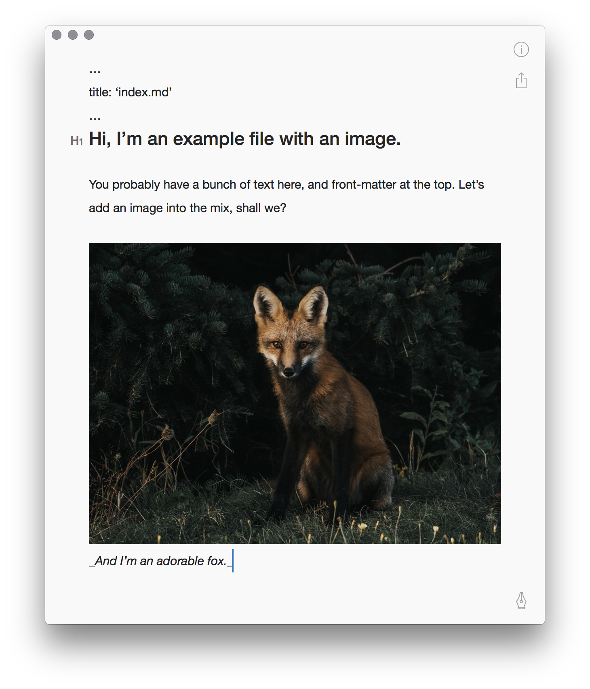

# lazyassets for metalsmith
**The lazy person's asset management plugin for Metalsmith.**

This is a plugin for [Metalsmith](http://metasmith.io/) that copies images — wherever they are in your filesystem — into your build folder. If you're using a markdown editor like Bear to edit your content, you no longer need to worry about where your inline images are actually saved. LazyAssets will find the file, copy it to the assets folder, and update your `` tags' src.

For example, take this sample `index.md`:


Cute fox! Do you remember where you saved him? If you're using LazyAssets, it doesn't matter if he's properly saved in your `src/assets/` folder, saved neatly in Dropbox, or randomly tossed into Downloads (which isn't optimal, but let's be real — it happens). LazyAssets will copy him into your build folder and update his `src` attribute automatically.

```js
let assets = require('metalsmith-lazyassets')

metalsmith
  // Make sure any Markdown conversion happens first
  .use(assets({
    pattern: '*.html', // Files to process
    assetsFolder: './assets' // Location of any static assets
  }))
  // If you're using any additional metadata 
  // plugins that rely on correct image paths, 
  // put them after.
```


